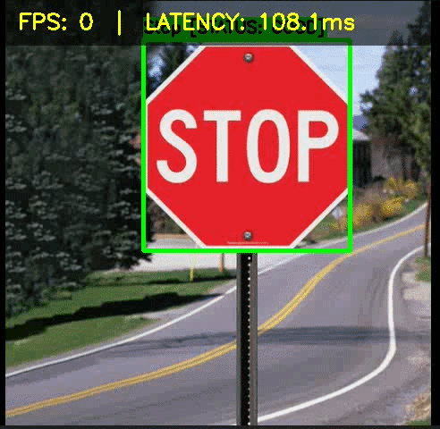

# 🚦 Traffic Sign Detection & Damage Assessment — Edge AI on NVIDIA Jetson Nano

> Real-time traffic sign detection and condition monitoring deployed on NVIDIA Jetson Nano using YOLOv8 + TensorRT FP16 optimization. Achieves **96% mAP** across 43 sign categories at **18 FPS** on edge hardware — with **50% memory reduction** over baseline.

    

---



---

## 🔍 Why This Project Exists

Traffic signs deteriorate from weather, vandalism, and aging — but manual inspection is slow, expensive, and dangerous for workers near live traffic. This system automates sign monitoring by running entirely **on-device**, with no internet required, no cloud costs, and no privacy tradeoff from uploading road footage.

One Jetson Nano device can scan hundreds of signs per day in real time.

---

## ⚡ Key Results

| Metric | Value |
|---|---|
| mAP@0.5 | **96.0%** |
| mAP@0.5:0.95 | 78.5% |
| Precision | 94.2% |
| Recall | 91.8% |
| F1-Score | 93.0% |
| Sign Classes | 43 (GTSRB) |

**Edge Deployment Performance (Jetson Nano)**

| | PyTorch FP32 | TensorRT FP16 | Improvement |
|---|---|---|---|
| FPS | 8 | **18** | **+125%** |
| Model Size | 12.5 MB | **6.2 MB** | **−50%** |
| Latency | ~125 ms | ~56 ms | **2.2× faster** |

---

## 🧠 How It Works

```
Input Video / Camera → Preprocessing → YOLOv8 Detection → Damage Assessment → Output + CSV Log
```

**Stage 1 — Detection:** YOLOv8n detects and classifies all 43 traffic sign types per frame at a confidence threshold of 0.40.

**Stage 2 — Damage Assessment:** Each detected sign is analyzed with two OpenCV-based techniques:
- **Texture Analysis** (Canny edge detection) → identifies rust, scratches, vandalism
- **Color Analysis** (HSV saturation) → identifies sun fading

**Stage 3 — Decision Logic:**
- `edge_density > 5.0%` → 🔴 **CRITICAL: DAMAGED**
- `avg_saturation < 100.0` → 🟡 **WARNING: FADED**
- Otherwise → 🟢 **STATUS: GOOD**

Hysteresis logic prevents flickering between frames.

**Stage 4 — Output:** Annotated video with color-coded bounding boxes + real-time FPS overlay, and a `damage_reports.csv` log with timestamps and sign conditions.

---

## 🛠 Tech Stack

| Layer | Tools |
|---|---|
| Detection Model | YOLOv8n (Ultralytics), PyTorch |
| Optimization | TensorRT FP16, NVIDIA JetPack |
| Computer Vision | OpenCV |
| Hardware | NVIDIA Jetson Nano 4GB |
| Training Data | GTSRB (39,209 train / 12,630 val images) |
| Language | Python 3.8+ |

---

## 📁 Repository Structure

```
├── main.py                  # Main inference pipeline
├── main_headless.py         # Headless mode for Jetson (no display)
├── training.py              # YOLOv8 training script
├── optimize.py              # TensorRT FP16 conversion
├── inference.py             # Standalone inference utilities
├── benchmark.py             # FPS and latency benchmarking
├── preprocessing.py         # Frame preprocessing utilities
├── analyze.py               # Damage assessment logic
├── config.py                # Hyperparameters and thresholds
├── logger.py                # CSV logging
├── utils.py                 # Helper functions
├── run_jetson.sh            # One-command Jetson Nano launcher
├── damage_reports.csv       # Sample output log
└── Requirements.txt
```

---

## 🚀 Setup & Run

### Prerequisites

**Hardware:** NVIDIA Jetson Nano (4GB, JetPack 4.6+) or any laptop/PC for baseline testing  
**Software:** Python 3.8+, Git, NVIDIA JetPack (for Jetson)

### Installation

```bash
git clone https://github.com/Diya-Saini29/EDP.git
cd EDP
pip install -r Requirements.txt
```

### Run on Laptop (Baseline)
```bash
python main.py --source traffic_video.mp4
```

### Run on Jetson Nano
```bash
# Standard PyTorch
python main_headless.py --source traffic_video.mp4

# TensorRT optimized (recommended)
python optimize.py          # converts model to TensorRT FP16 (run once)
bash run_jetson.sh          # launches optimized pipeline
```

### Benchmark Performance
```bash
python benchmark.py --model traffic_model_96.pt
```

---

## 📊 Training Details

| Hyperparameter | Value |
|---|---|
| Dataset | GTSRB (43 classes) |
| Epochs | 25 |
| Batch Size | 16 |
| Image Size | 640 × 640 |
| Optimizer | AdamW |
| Learning Rate | 0.001 |
| Weight Decay | 0.0005 |

Training loss decreased from ~2.5 → ~0.8 over 25 epochs. mAP@0.5 converged to 96.0% by epoch 25.

---

## ☁️ Edge vs Cloud

| Factor | Cloud-Only | This System (Jetson Nano) |
|---|---|---|
| Internet | Always required | Works offline |
| Latency | 500–2000 ms | < 100 ms |
| Bandwidth | Full video upload | Text alerts only |
| Privacy | Video on remote servers | All data stays local |
| Ongoing Cost | Cloud + bandwidth fees | Zero after hardware |

---

## 👩‍💻 Author

**Diya Saini** — AI/ML Undergraduate, Thapar Institute of Engineering and Technology  
[LinkedIn](https://linkedin.com/in/diya-saini-ml) · [GitHub](https://github.com/Diya-Saini29) · sainidiya889@gmail.com
